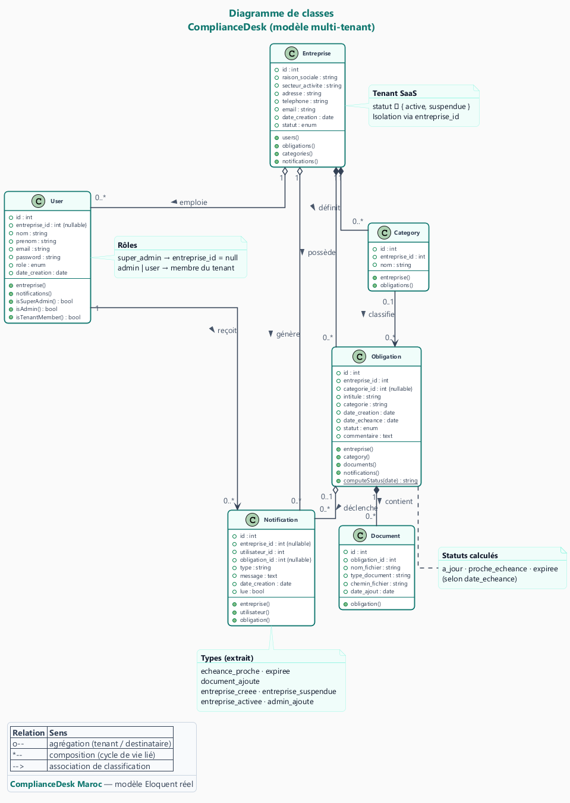

<p align="center">
  
  &nbsp;&nbsp;
  
</p>

<h1 align="center">ComplianceDesk</h1>

<p align="center">
  SaaS multi-tenant · Suivi des obligations réglementaires des PME marocaines<br/>
  (CNSS, assurances, médecine du travail, autorisations…)
</p>

<p align="center">
  
  
  
  
  
  
  
</p>

---

## Stack

| Couche | Technologie |
|--------|-------------|
| Frontend | React 18, Vite 5, Tailwind CSS 3, react-router-dom 6 |
| Backend | Laravel 12, PHP 8.2+, Sanctum (API tokens) |
| BDD | MySQL 8+ / SQLite |
| Emails | Brevo SMTP (Mailpit en dev) |
| Qualité | PHPUnit, Vitest, Pint, SonarCloud |
| CI/CD | GitHub Actions |
| Docker | backend + MySQL + Mailpit |

---

## Démarrer en 30s

```bash
# Backend
cd backend; composer install; copy .env.example .env; php artisan key:generate
```
```env
DB_CONNECTION=mysql
DB_HOST=127.0.0.1
DB_PORT=3306
DB_DATABASE=compliancedesk
DB_USERNAME=root
DB_PASSWORD=
```
Puis :
```bash
php artisan migrate --seed
```

```bash
# Frontend
cd frontend; npm install; npm run dev
```

```bash
# Terminal 2 — API
cd backend; php artisan serve
```

```bash
# Terminal 3 — Queue (si QUEUE_CONNECTION=database)
cd backend; php artisan queue:work
```

**App** → http://localhost:3000 · **API** → http://localhost:8000

---

## Comptes démo

| Rôle | Email | Mot de passe |
|------|-------|--------------|
| Super admin | `superadmin@compliancedesk.ma` | `password` |
| Admin | `admin@compliancedesk.ma` | `password` |
| Utilisateur | `user@compliancedesk.ma` | `password` |

---

## Rôles

| Rôle | Accès |
|------|-------|
| `super_admin` | Console `/admin/*` — CRUD entreprises, suspension, stats globales |
| `admin` | Gestion complète de son entreprise : obligations, utilisateurs, catégories |
| `user` | Consultation, documents, notifications |

---

## Structure

```
backend/         API Laravel (port 8000)
├── Controllers/Api/     REST
├── Middleware/           tenant, rôles
├── Models/               Eloquent + TenantScope
├── Policies/             autorisations
├── Services/             métier
└── routes/api.php
frontend/        SPA React (port 3000)
├── api/                  Axios
├── components/           UI réutilisable
├── context/              Auth, thème, toast, loading
├── pages/                13 pages
├── utils/                date, nav, obligation
others/          Captures, UML, logos, rapport
scripts/         SonarCloud, couverture PHP
```

## Modèles

<p align="center">
  
</p>

---

## API

**Auth** → `POST /api/login` · `POST /api/logout` · `POST /api/password/set`

**Profil** → `GET|PUT /api/user` · `PUT /api/user/password`

**Entreprises** (super_admin) :
`GET|POST /api/entreprises` · `GET|PUT /api/entreprises/{id}` · `PATCH …/statut`
`GET|POST /api/entreprises/{id}/users` · `PUT|DELETE …/users/{uid}`

**Dashboard** → `GET /api/dashboard` · `GET /api/admin/dashboard`

**Obligations** (tenant) :
`GET|POST /api/obligations` · `GET|PUT|DELETE /api/obligations/{id}`

**Documents** :
`GET|POST /api/obligations/{id}/documents` · `GET /api/documents/{id}/download` · `DELETE /api/documents/{id}`

**Catégories** → `GET|POST /api/categories` · `DELETE /api/categories/{id}`

**Notifications** → `GET /api/notifications` · `PATCH …/{id}/read` · `PATCH …/read-all` · `GET …/unread-count`

---

## BDD

| Table | Description |
|-------|-------------|
| `entreprises` | Tenants (raison sociale, statut) |
| `users` | Multi-tenant (rôle : super_admin, admin, user) |
| `categories` | Catégories par entreprise |
| `obligations` | Intitulé, échéance, statut, catégorie |
| `documents` | Fichiers attachés |
| `notifications` | Alertes (8 types) |

---

## Docker

```bash
docker compose up --build
```
- API :8000 · Mailpit :8025 · MySQL :3306 (frontend toujours via `npm run dev`)

---

## Emails

| Email | Déclencheur |
|-------|-------------|
| Compte créé | Création utilisateur (lien `/set-password`) |
| Entreprise suspendue | Suspension tenant |

Sans Brevo : `MAIL_MAILER=log` dans `.env`.  
**Ne jamais committer la clé SMTP.**

---

## Tests & Qualité

```bash
cd backend; php artisan test          # PHPUnit
cd frontend; npm test                 # Vitest
npm run sonar:full                    # SonarCloud
```

CI (GitHub Actions) à chaque push :
1. Tests PHP + couverture → artifact
2. Tests + build React
3. Scan SonarCloud

---

## Captures

| | | |
|---|---|---|
| [Accueil](others/captures/01_1_accueil.png) | [Dashboard](others/captures/04_dashboard.png) | [Obligations](others/captures/05_obligations.png) |
| [Notifications](others/captures/06_notifications.png) | [Détail](others/captures/10_obligation_detail.png) | [Dark mode](others/captures/11_dashboard_dark.png) |
| [Admin](others/captures/12_admin_entreprises.png) | [Profil](others/captures/08_profil.png) | [Utilisateurs](others/captures/09_utilisateurs.png) |

---

## Dépannage

| Problème | Solution |
|----------|----------|
| `APP_KEY` manquant | `php artisan key:generate` |
| Erreur 500 | Voir `storage/logs/laravel.log` |
| CORS | Vérifier proxy Vite |
| Migration refusée | Vérifier `DB_USERNAME`/`DB_PASSWORD` |
| Emails bloqués | Lancer `php artisan queue:work` |
| Classe introuvable | `composer dump-autoload` |
| Port pris | `php artisan serve --port=8001` |
| SonarCloud échoue | Vérifier `SONAR_TOKEN` dans secrets GitHub |

---

<p align="center">
  <i>Stage — ENTSI</i>
</p>