<p align="center">
  
  &nbsp;&nbsp;&nbsp;&nbsp;
  
</p>

<h1 align="center">ComplianceDesk</h1>

<p align="center">
  SaaS multi-tenant pour le suivi des obligations réglementaires des PME marocaines<br/>
  (CNSS, assurances, médecine du travail, autorisations administratives, etc.)
</p>

<p align="center">
  
  
  
  
  
  
  
</p>

---

## Sommaire

- [Présentation](#présentation)
- [Stack](#stack)
- [Architecture](#architecture)
- [Structure du projet](#structure-du-projet)
- [Prérequis](#prérequis)
- [Installation rapide](#installation-rapide)
- [Démarrage](#démarrage)
- [Docker](#docker)
- [Comptes de démo](#comptes-de-démo)
- [Rôles et permissions](#rôles-et-permissions)
- [API](#api)
- [Base de données](#base-de-données)
- [Emails](#emails)
- [Tests](#tests)
- [Quality & CI](#quality--ci)
- [Commandes utiles](#commandes-utiles)
- [Captures d'écran](#captures-décran)
- [Dépannage](#dépannage)

---

## Présentation

Chaque entreprise cliente (tenant) dispose d'un espace isolé. Les utilisateurs peuvent :

- Suivre leurs obligations réglementaires avec leurs échéances et statuts
- Attacher des justificatifs (documents)
- Recevoir des notifications
- Surveiller le tableau de bord de conformité

Un **super_admin** (console centralisée) gère l'ensemble des entreprises de la plateforme.

---

## Stack

| Couche | Technologie |
|--------|-------------|
| **Frontend** | React 18, Vite 5, Tailwind CSS 3, react-router-dom 6 |
| **Backend** | Laravel 12, PHP 8.2+, Sanctum (API tokens) |
| **Base de données** | MySQL 8+ (recommandé) ou SQLite |
| **Emails** | Brevo SMTP (Mailpit en dev) |
| **Qualité** | PHPUnit, Vitest, Laravel Pint, SonarCloud |
| **CI/CD** | GitHub Actions |
| **Conteneurisation** | Docker Compose (backend + MySQL + Mailpit) |

---

## Architecture

<p align="center">
  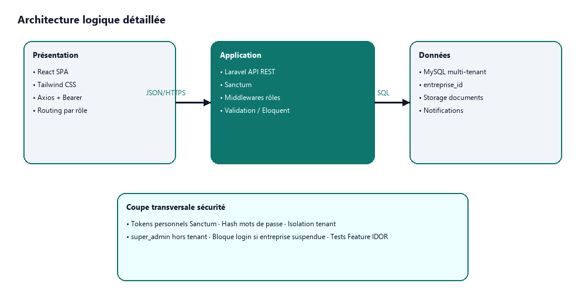
</p>

### Multi-tenant

L'isolation des données repose sur un **TenantScope** global qui filtre automatiquement les requêtes par `entreprise_id`. Chaque modèle métier (`Obligation`, `Category`) utilise le trait `BelongsToTenant`.

```
Entreprise 1───* User
Entreprise 1───* Obligation
Entreprise 1───* Category
Obligation 1───* Document
Obligation 1───* Notification
User       1───* Notification
```

### Diagrammes UML

| Diagramme | Description |
|-----------|-------------|
| [Cas d'utilisation Super Admin](others/uml/01a-usecases-super-admin.png) | Fonctionnalités super_admin |
| [Cas d'utilisation Admin](others/uml/01b-usecases-admin.png) | Fonctionnalités admin entreprise |
| [Cas d'utilisation Utilisateur](others/uml/01c-usecases-user.png) | Fonctionnalités utilisateur |
| [Diagramme de classes](others/uml/02-class-diagram.png) | Structure des modèles |
| [MCD](others/uml/03-mcd.png) | Modèle Conceptuel de Données |
| [Séquence connexion](others/uml/sequence_login.png) | Flux d'authentification |
| [Séquence obligation](others/uml/sequence_obligation.png) | Création d'une obligation |

---

## Structure du projet

```
ComplianceDesk/
├── backend/              API Laravel (port 8000)
│   ├── app/
│   │   ├── Http/Controllers/Api/    Contrôleurs REST
│   │   ├── Http/Middleware/          Middleware (tenant, rôles)
│   │   ├── Models/                   Modèles Eloquent
│   │   ├── Policies/                 Politiques d'autorisation
│   │   └── Services/                 Logique métier
│   ├── database/migrations/          14 migrations
│   └── routes/api.php                Routes API
├── frontend/             SPA React (port 3000)
│   ├── src/
│   │   ├── api/                      Axios instance
│   │   ├── components/               Composants réutilisables
│   │   ├── context/                  Auth, thème, toast, loading
│   │   ├── pages/                    13 pages (dashboard, obligations, etc.)
│   │   └── utils/                    Utilitaires (dates, navigation)
│   └── vite.config.js                Proxy API vers :8000
├── others/               Documentation
│   ├── captures/                     Captures d'écran
│   ├── docs/                         Rapport de stage
│   ├── outils/                       Logos technologies
│   └── uml/                          Diagrammes UML
├── scripts/              SonarCloud & couverture
└── sonar-project.properties         Configuration SonarCloud
```

---

## Prérequis

- **PHP** 8.2+ & **Composer**
- **Node.js** 18+ & **npm**
- **MySQL** 8+ (ou SQLite pour test)
- **Docker** (optionnel)

---

## Installation rapide

### Backend

```bash
cd backend
composer install
copy .env.example .env
php artisan key:generate
```

Configurer MySQL dans `backend/.env` :

```env
DB_CONNECTION=mysql
DB_HOST=127.0.0.1
DB_PORT=3306
DB_DATABASE=compliancedesk
DB_USERNAME=root
DB_PASSWORD=
```

Puis :

```bash
php artisan migrate --seed
```

### Frontend

```bash
cd frontend
npm install
```

Les appels `/api` sont proxifiés vers `http://localhost:8000` (voir `frontend/vite.config.js`).

---

## Démarrage

Deux terminaux :

```bash
# Terminal 1 — API
cd backend
php artisan serve
```

```bash
# Terminal 2 — interface
cd frontend
npm run dev
```

- **Application** : http://localhost:3000
- **API** : http://localhost:8000

Si les emails sont en file (`QUEUE_CONNECTION=database`) :

```bash
cd backend
php artisan queue:work
```

---

## Docker

```bash
docker compose up --build
```

- **API** : http://localhost:8000
- **Mailpit** : http://localhost:8025
- **MySQL** : `localhost:3306` (`compliancedesk` / `secret`)

Le frontend se lance toujours avec `npm run dev` (port 3000).

---

## Comptes de démo

Après `php artisan migrate --seed` :

| Rôle | Email | Mot de passe |
|------|-------|--------------|
| Super admin | `superadmin@compliancedesk.ma` | `password` |
| Admin | `admin@compliancedesk.ma` | `password` |
| Utilisateur | `user@compliancedesk.ma` | `password` |

> **⚠️ Production** : changer les mots de passe seeders. Il n'y a pas d'inscription publique : les comptes sont créés par un supérieur.

---

## Rôles et permissions

| Rôle | Accès |
|------|-------|
| `super_admin` | Console d'administration (`/admin/*`) : CRUD entreprises, suspension, stats globales, gestion des admins |
| `admin` | Gestion complète de son entreprise : obligations, utilisateurs, documents, dashboard, catégories |
| `user` | Consultation des obligations, téléchargement des documents, notifications |

Une chaîne de 4 middlewares REST gère les accès :

```
auth:sanctum  →  EnsureEntrepriseActive  →  EnsureTenantMember  →  EnsureTenantAdmin (pour les actions admin)
```

---

## API

Toutes les routes sont préfixées par `/api`. Authentification via **Sanctum** (Bearer token).

### Authentification

| Méthode | Route | Description |
|---------|-------|-------------|
| POST | `/api/login` | Connexion (rate-limited) |
| POST | `/api/logout` | Déconnexion |
| POST | `/api/password/set` | Définir mot de passe depuis invitation |

### Profil

| Méthode | Route | Description |
|---------|-------|-------------|
| GET | `/api/user` | Profil connecté |
| PUT | `/api/user` | Modifier profil |
| PUT | `/api/user/password` | Changer mot de passe |

### Entreprises (super_admin)

| Méthode | Route | Description |
|---------|-------|-------------|
| GET | `/api/entreprises` | Lister les entreprises |
| POST | `/api/entreprises` | Créer une entreprise |
| GET | `/api/entreprises/{id}` | Détail entreprise |
| PUT | `/api/entreprises/{id}` | Modifier entreprise |
| PATCH | `/api/entreprises/{id}/statut` | Suspendre / activer |
| POST | `/api/entreprises/{id}/admins` | Ajouter un admin |
| GET | `/api/entreprises/{id}/users` | Lister utilisateurs |
| POST | `/api/entreprises/{id}/users` | Créer un utilisateur |
| PUT | `/api/entreprises/{id}/users/{uid}` | Modifier utilisateur |
| DELETE | `/api/entreprises/{id}/users/{uid}` | Supprimer utilisateur |

### Dashboard

| Méthode | Route | Description |
|---------|-------|-------------|
| GET | `/api/dashboard` | Stats tenant (obligations par statut, échéances) |
| GET | `/api/admin/dashboard` | Stats globales (super_admin) |

### Obligations (tenant)

| Méthode | Route | Description |
|---------|-------|-------------|
| GET | `/api/obligations` | Lister les obligations |
| POST | `/api/obligations` | Créer une obligation (admin) |
| GET | `/api/obligations/{id}` | Détail obligation |
| PUT | `/api/obligations/{id}` | Modifier (admin) |
| DELETE | `/api/obligations/{id}` | Supprimer (admin) |

### Documents

| Méthode | Route | Description |
|---------|-------|-------------|
| GET | `/api/obligations/{id}/documents` | Documents d'une obligation |
| POST | `/api/obligations/{id}/documents` | Uploader un document |
| GET | `/api/documents/{id}/download` | Télécharger |
| DELETE | `/api/documents/{id}` | Supprimer (admin) |

### Catégories

| Méthode | Route | Description |
|---------|-------|-------------|
| GET | `/api/categories` | Lister les catégories |
| POST | `/api/categories` | Créer (admin) |
| DELETE | `/api/categories/{id}` | Supprimer (admin) |

### Notifications

| Méthode | Route | Description |
|---------|-------|-------------|
| GET | `/api/notifications` | Lister les notifications |
| PATCH | `/api/notifications/{id}/read` | Marquer comme lue |
| PATCH | `/api/notifications/read-all` | Tout marquer comme lu |
| GET | `/api/notifications/unread-count` | Nombre de non-lues |

---

## Base de données

### Tables principales

| Table | Description |
|-------|-------------|
| `entreprises` | Tenants (raison sociale, secteur, statut actif/suspendu) |
| `users` | Utilisateurs multi-tenant (rôle : super_admin, admin, user) |
| `categories` | Catégories d'obligations par entreprise |
| `obligations` | Obligations (intitulé, échéance, statut, catégorie) |
| `documents` | Fichiers attachés aux obligations |
| `notifications` | Alertes  (8 types : échéance, suspension, etc.) |

### Migrations

```bash
# Voir l'état
php artisan migrate:status

# Rejouer depuis zéro
php artisan migrate:fresh --seed
```

---

## Emails (Brevo)

| Email | Déclencheur |
|-------|-------------|
| Compte créé | Création d'un utilisateur / admin (lien `/set-password`) |
| Entreprise suspendue | Suspension d'un tenant (notifie les admins) |

### Configuration `.env`

```env
MAIL_MAILER=smtp
MAIL_HOST=smtp-relay.brevo.com
MAIL_PORT=587
MAIL_USERNAME=ton-email-brevo
MAIL_PASSWORD=ta-clé-smtp
MAIL_FROM_ADDRESS=expediteur-verifie@domaine.ma
FRONTEND_URL=http://localhost:3000
```

En local sans Brevo : `MAIL_MAILER=log` (les emails sont écrits dans les logs Laravel).

> **⚠️ Ne jamais committer la clé SMTP.**

---

## Tests

```bash
# Backend (PHPUnit)
cd backend
php artisan test

# Frontend (Vitest)
cd frontend
npm test

# Avec couverture PHP
cd backend
php artisan test --coverage-clover=coverage.xml
```

---

## Quality & CI

La qualité du code est assurée par :

- **Laravel Pint** — Style PHP (PSR-12)
- **GitHub Actions** — CI à chaque push :
  1. Tests PHP + couverture
  2. Tests et build React
  3. Scan SonarCloud (qualité, vulnérabilités, couverture)
- **SonarCloud** — Analyse statique, dette technique, security hotspots

```bash
# SonarCloud local
npm run sonar:full
```

(Le token SonarCloud doit être présent dans `.sonarcloud.token` ou la variable d'env `SONAR_TOKEN`.)

---

## Commandes utiles

```bash
# Recréer la base (efface les données)
cd backend && php artisan migrate:fresh --seed

# Recalcul des statuts d'obligations (quotidien)
php artisan obligations:refresh-statuts

# Voir toutes les routes API
php artisan route:list --path=api

# Vider le cache
php artisan optimize:clear

# SonarCloud
npm run sonar:full
```

---

## Captures d'écran

| Page | Aperçu |
|------|--------|
| Accueil | 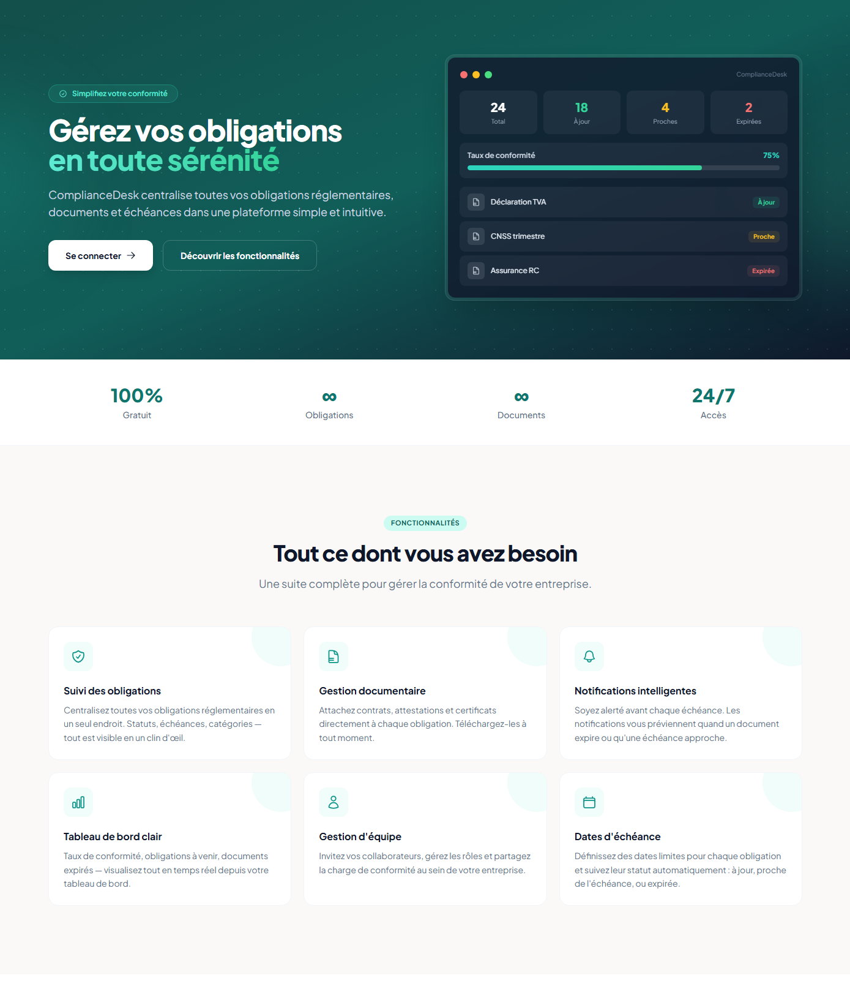 |
| Connexion | 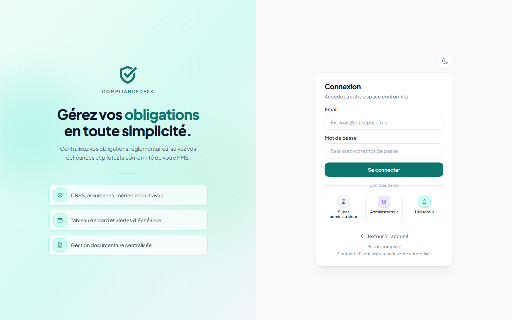 |
| Dashboard | 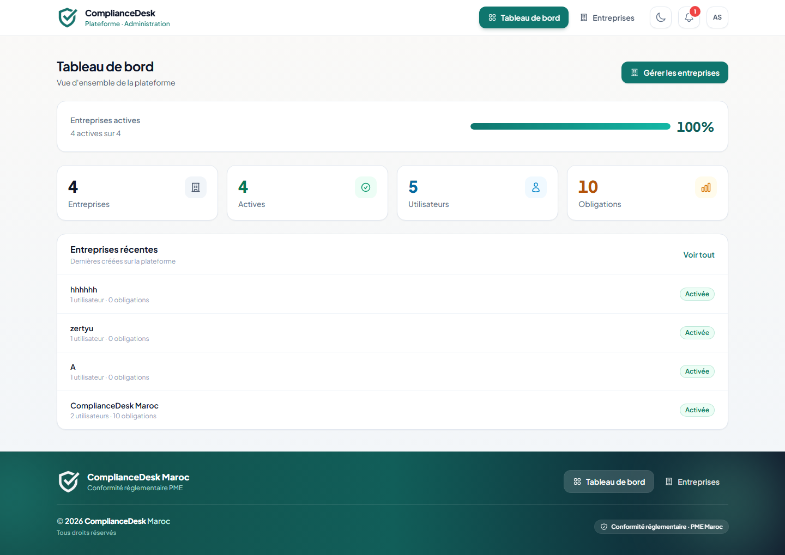 |
| Obligations | 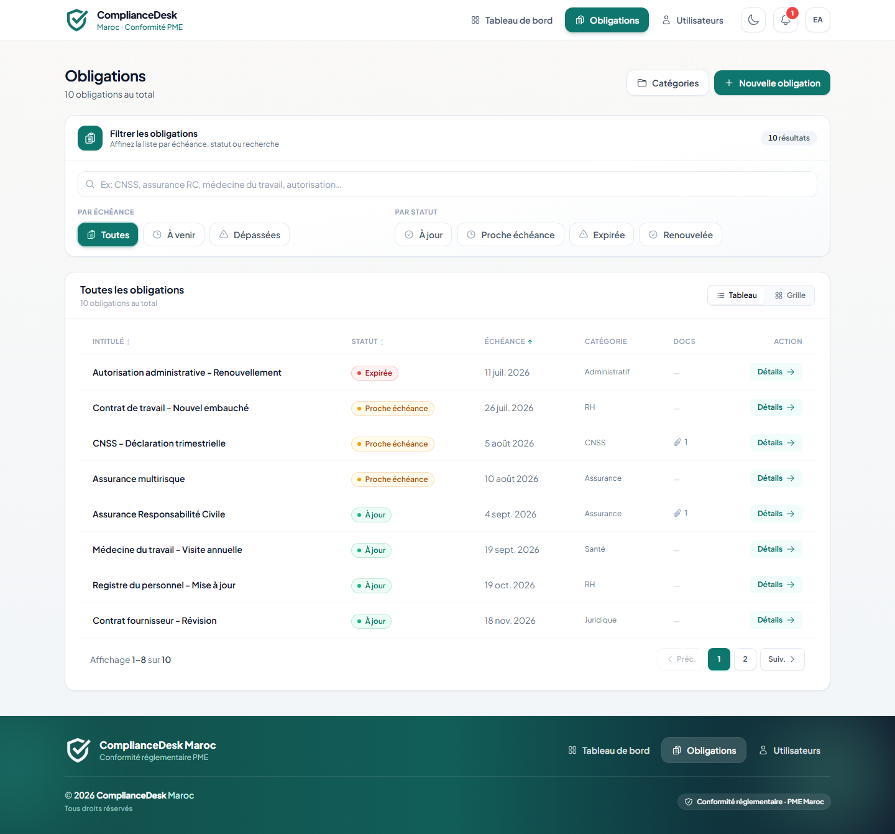 |
| Notifications | 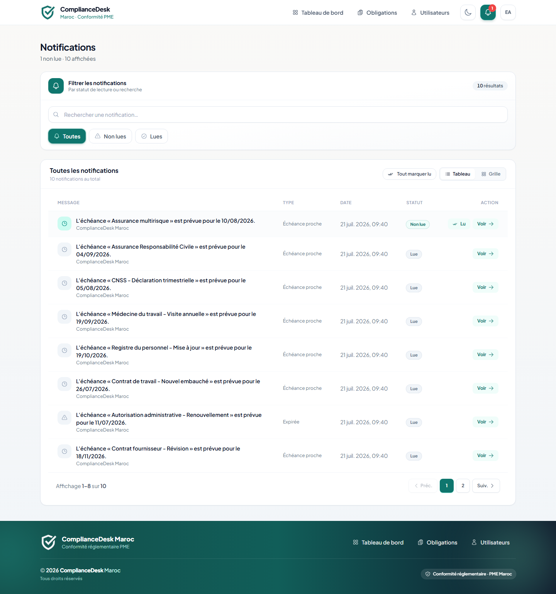 |
| Profil entreprise | 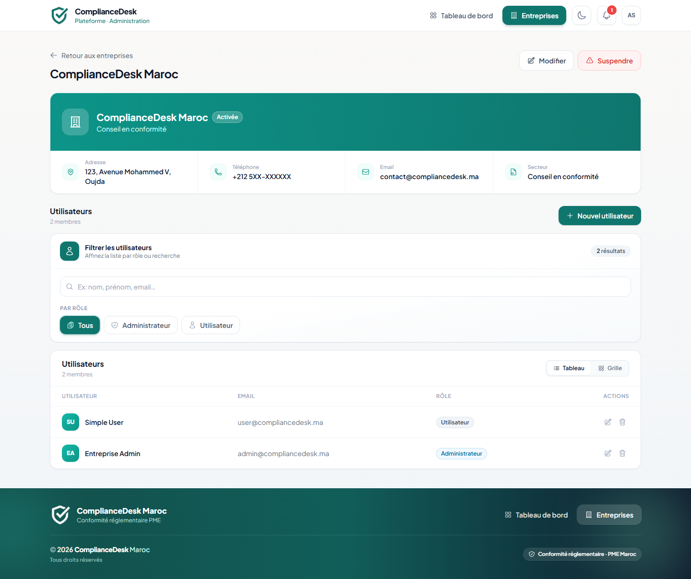 |
| Utilisateurs | 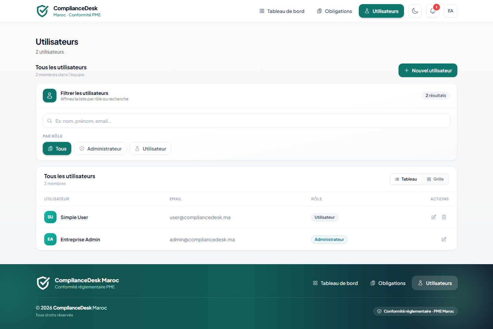 |
| Détail obligation | 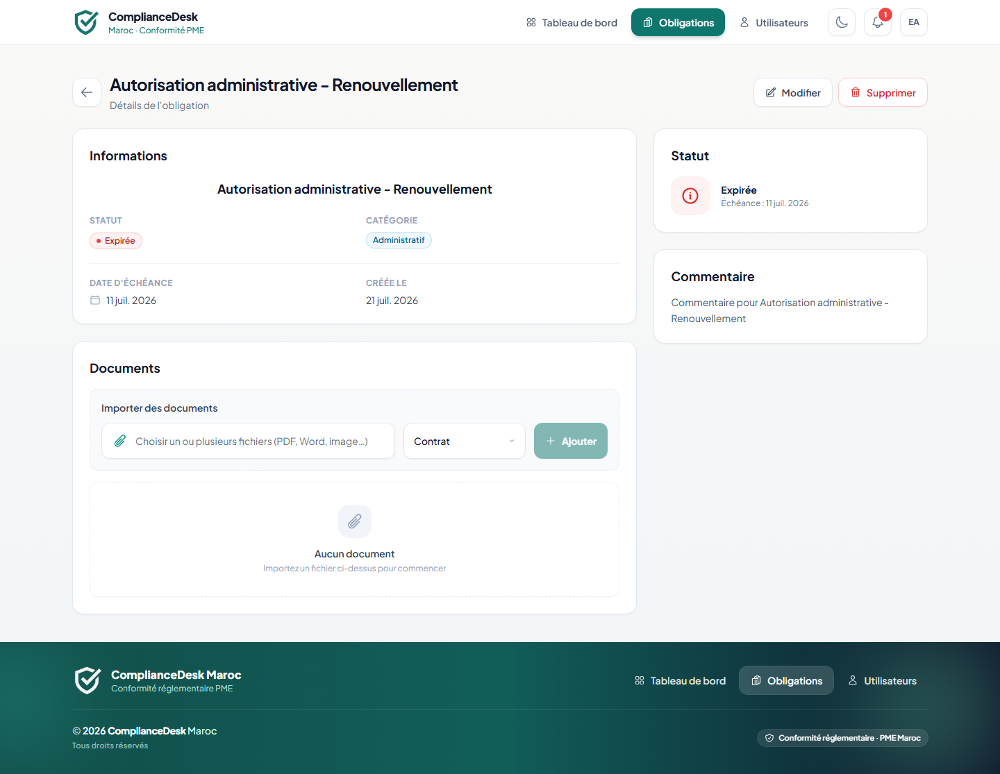 |
| Mode sombre | 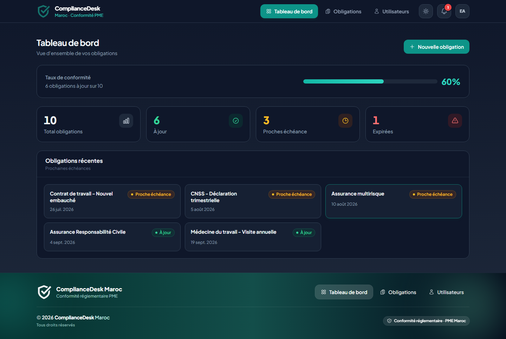 |
| Admin entreprises | 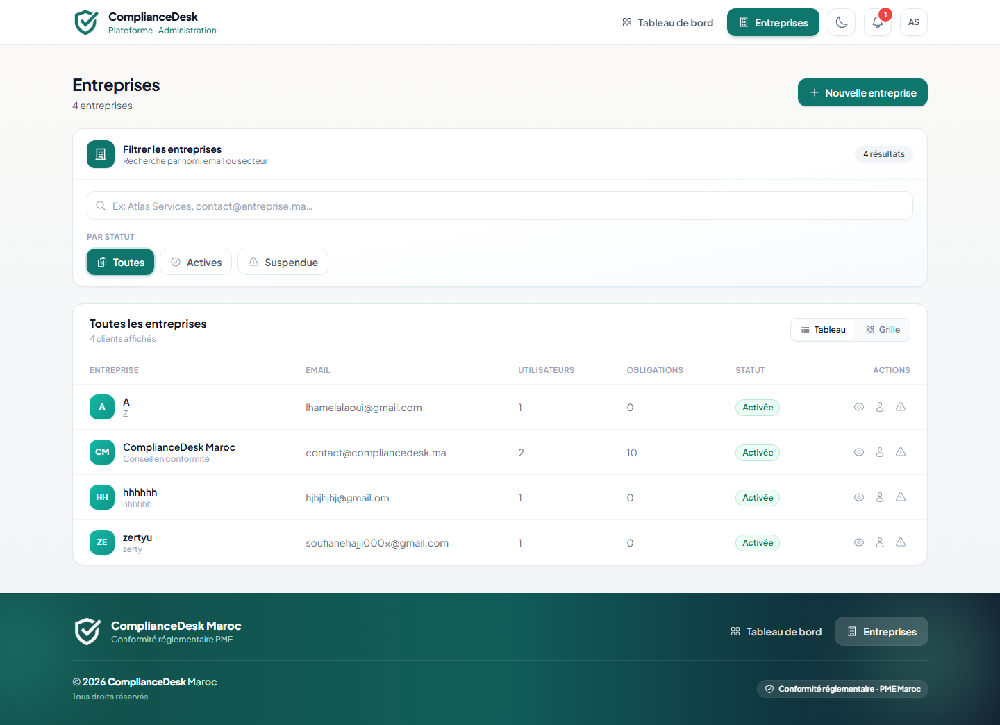 |

---

## Dépannage

| Problème | Solution |
|----------|----------|
| `APP_KEY` manquant | `php artisan key:generate` |
| Erreur 500 API | Vérifier `backend/storage/logs/laravel.log` |
| CORS bloque les requêtes | Vérifier que le proxy Vite est actif (`vite.config.js`) |
| Migration `Access denied` | Vérifier `DB_USERNAME` / `DB_PASSWORD` dans `.env` |
| Emails non envoyés | Vérifier `QUEUE_CONNECTION` ; lancer `php artisan queue:work` |
| `Class not found` | `composer dump-autoload` |
| Port 3000/8000 déjà utilisé | `php artisan serve --port=8001` ou changer le port Vite |
| CI SonarCloud échoue | Vérifier `SONAR_TOKEN` dans les secrets GitHub |

---

<p align="center">
  <i>Projet réalisé dans le cadre du stage de fin d'études — ENTSI</i><br/>
  
</p>